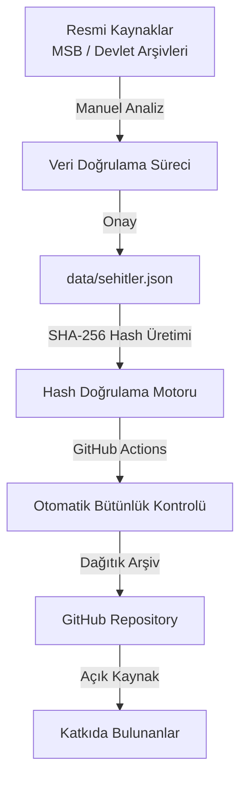

<p align="center">
  
</p>

# sehitler-hafiza-aniti
Bayrakları bayrak yapan üstündeki kandır, Toprak eğer uğrunda ölen varsa vatandır.

[README  sehit.md](https://github.com/user-attachments/files/29624695/README.sehit.md)
<!--
  ╔══════════════════════════════════════════════════════════════════════════════╗
  ║                                                                              ║
  ║   MUHAFIZ | Dijital Hafıza & Şehitlerimizi Anma Platformu                    ║
  ║                                                                              ║
  ║   "Bayrakları bayrak yapan üstündeki kandır,                                 ║
  ║    Toprak eğer uğrunda ölen varsa vatandır."                                 ║
  ║                                                                              ║
  ║   Bu proje; vatanı, milleti ve mukaddes değerleri uğruna canlarını           ║
  ║   feda eden aziz şehitlerimizin hatırasını dijital dünyada sonsuza dek       ║
  ║   yaşatmak ve manipüle edilemez açık kaynaklı bir arşiv oluşturmak            ║
  ║   amacıyla başlatılmış kutsal bir emanettir.                                 ║
  ║                                                                              ║
  ╚══════════════════════════════════════════════════════════════════════════════╝
-->

<div align="center">

<!-- ═══════════════════════════════════════════════════════════════════════════ -->
<!-- HEADER BANNER -->
<!-- ═══════════════════════════════════════════════════════════════════════════ -->


<br><br>

<!-- ═══════════════════════════════════════════════════════════════════════════ -->
<!-- ANA SÖZ / MİLLİ MANEVİAT -->
<!-- ═══════════════════════════════════════════════════════════════════════════ -->

<h1>🇹🇷</h1>

<p align="center">
  
  
  
</p>

<p align="center">
  
  
  
</p>

<br>

> <h3><em>"Bayrakları bayrak yapan üstündeki kandır,<br>Toprak eğer uğrunda ölen varsa vatandır."</em></h3>
> <p><strong>— Mehmet Akif Ersoy</strong></p>

<br>

</div>

---

## 📋 İçindekiler

- [🦅 Proje Hakkında](#-proje-hakkında)
- [🏛️ Vizyon ve Misyon](#️-vizyon-ve-misyon)
- [🎖️ Şehitlerimizin Hafızası](#️-şehitlerimizin-hafızası)
  - [Çanakkale Şehitlerimiz](#çanakkale-şehitlerimiz-1915-1916)
  - [Kurtuluş Savaşı Şehitlerimiz](#kurtuluş-savaşı-şehitlerimiz-1919-1922)
  - [Kore Savaşı Şehitlerimiz](#kore-savaşı-şehitlerimiz-1950-1953)
  - [Kıbrıs Barış Harekatı Şehitlerimiz](#kıbrıs-barış-harekatı-şehitlerimiz-1974)
  - [Terörle Mücadele Şehitlerimiz](#terörle-mücadele-şehitlerimiz-1984-günümüz)
  - [15 Temmuz Şehitlerimiz](#15-temmuz-şehitlerimiz-15072016)
  - [Pençe-Kilit Şehitlerimiz](#pençe-kilit-şehitlerimiz-2025)
- [💬 Anma Sözleri](#-anma-sözleri)
- [🛠️ Teknik Mimari](#️-teknik-mimari)
- [🔒 Siber Güvenlik Standartları](#-siber-güvenlik-standartları)
- [⚖️ Veri Doğrulama Süreci](#️-veri-doğrulama-süreci)
- [🚀 Kurulum ve Kullanım](#-kurulum-ve-kullanım)
- [🤝 Katkıda Bulunma](#-katkıda-bulunma)
- [🙏 Saygı ve Teşekkür](#-saygı-ve-teşekkür)
- [📜 Lisans](#-lisans)

---

## 🦅 Proje Hakkında

**Muhafız**, vatanı, milleti ve mukaddes değerleri uğruna canlarını feda eden aziz şehitlerimizin hatırasını dijital dünyada sonsuza dek yaşatmak ve manipüle edilemez açık kaynaklı bir arşiv oluşturmak amacıyla başlatılmış kutsal bir emanettir.

Bu platform, sıradan veri tabanlarının aksine, **siber güvenlik standartları** doğrultusunda veri manipülasyonuna ve sabote edilmeye karşı **kriptografik koruma** vizyonuyla kurgulanmıştır.

> *"Tarihimiz boyunca vatan savunmasında şehadete eren kahramanlarımızın isimlerini, rütbelerini ve şehadet hikayelerini açık kaynak dünyasında kalıcı hale getirmek."*

---

## 🏛️ Vizyon ve Misyon

| Prensip | Açıklama |
|---------|----------|
| **🛡️ Dijital Hafıza** | Şehitlerimizin bilgilerinin dijital ortamda kalıcı ve erişilebilir olmasını sağlamak |
| **🔐 Veri Bütünlüğü** | Kötü niyetli manipülasyonlara karşı kriptografik korumalar uygulamak |
| **📖 Açık Kaynak Şeffaflığı** | Verilerin GitHub üzerinde dağıtık ve şeffaf olarak saklanması |
| **⚖️ Resmi Kaynak Doğrulaması** | Milli Savunma Bakanlığı (MSB) ve resmi devlet kayıtları referans alınarak veri onayı |

---

## 🎖️ Şehitlerimizin Hafızası

> *"Şehitler ölmez, vatan bölünmez!"*

Bu bölümde, tarihimizin dönüm noktalarında canlarını vatan uğruna feda eden aziz şehitlerimizin isimleri, rütbeleri ve kahramanlık hikayeleri yer almaktadır. Her isim, bir emanettir. Her hatıra, bir namustur.

---

### Çanakkale Şehitlerimiz (1915-1916)

```
╔══════════════════════════════════════════════════════════════════════════════╗
║                                                                              ║
║   "Çanakkale geçilmez!"                                                      ║
║                                                                              ║
║   18 Mart 1915 - 9 Ocak 1916                                                 ║
║   Toplam Şehit: 92.000 kahraman                                              ║
║   Yaralı (Gazi): 161.000                                                     ║
║   Toplam Zayiat: 253.000                                                     ║
║                                                                              ║
║   ATASE ve Milli Savunma Bakanlığı resmi kayıtlarına göre;                   ║
║   Gelibolu Yarımadası'nda 92.000 şehidimiz toprağa düşmüştür.                ║
║                                                                              ║
║   Her bir karış toprak, binlerce şehidimizin kanıyla sulanmıştır.            ║
║   Conkbayırı, Arıburnu, Seddülbahir, Anafartalar...                          ║
║   Bu topraklar şehitlerimizin emaneti olarak bizlere kalmıştır.              ║
║                                                                              ║
╚══════════════════════════════════════════════════════════════════════════════╝
```

**Unutulmaz Kahramanlarımız:**

| İsim | Rütbe/Meslek | Şehadet Hikayesi |
|------|-------------|------------------|
| **Mehmet Çavuş** | Çavuş, 57. Alay | Conkbayırı'nda siperlerde son nefesine kadar direndi. "Çanakkale geçilmez" destanının sembol isimlerinden. |
| **Hasan Tahsin** | Gazeteci | İzmir'de işgalci Yunan kuvvetlerine ilk kurşunu atan kahraman. |
| **92.000 Şehit** | Çeşitli Rütbeler | Gelibolu Yarımadası'nda canlarını vatan uğruna feda eden tüm kahramanlarımız. |

> *"Bu topraklar, şehitlerimizin kanıyla vatan oldu!"*

---

### Kurtuluş Savaşı Şehitlerimiz (1919-1922)

```
╔══════════════════════════════════════════════════════════════════════════════╗
║                                                                              ║
║   "Ya İstiklal, Ya Ölüm!"                                                    ║
║                                                                              ║
║   19 Mayıs 1919 - 11 Ekim 1922                                               ║
║   Toplam Şehit: ~130.000 kahraman                                            ║
║                                                                              ║
║   Sakarya'da, Dumlupınar'da, İnönü'de, Başkomutanlık Meydan Muharebesi'nde   ║
║   canlarını feda eden tüm şehitlerimiz...                                    ║
║                                                                              ║
║   Mustafa Kemal Atatürk önderliğinde verilen bağımsızlık mücadelesinde        ║
║   şehadete eren kahramanlarımızın ruhları şad olsun.                         ║
║                                                                              ║
╚══════════════════════════════════════════════════════════════════════════════╝
```

> *"Vatan için can verenler, asla unutulmaz."*

---

### Kore Savaşı Şehitlerimiz (1950-1953)

```
╔══════════════════════════════════════════════════════════════════════════════╗
║                                                                              ║
║   "Kore'de Türk Süngüsü Çinlilerin Kabusu Oldu!"                             ║
║                                                                              ║
║   25 Eylül 1950 - 27 Temmuz 1953                                             ║
║   Toplam Şehit: 724 kahraman                                                 ║
║   Yaralı: 2.147                                                              ║
║   Esir: 234                                                                  ║
║   Kayıp: 166                                                                 ║
║   Savaşa Katılan: 21.212 asker                                               ║
║                                                                              ║
║   1., 2., 3. ve 4. Türk Tugayları                                            ║
║   Kunuri Muharebesi, Kumyangjang-ni Muharebesi, Vegas Muharebesi             ║
║                                                                              ║
╚══════════════════════════════════════════════════════════════════════════════╝
```

**Unutulmaz Kahramanlarımız:**

| İsim | Rütbe | Şehadet Hikayesi |
|------|-------|------------------|
| **Mehmet Günenç** | Üsteğmen, Topçu İleri Gözetleyici | Sunchon Boğazı'nda kuşatılan tepeyi teslim etmek istemedi. Telsizden: *"Verdiğiniz koordinatlar bulunduğunuz yerdir."* - *"Evet öyle, biz düşmana teslim olmak istemiyoruz, bizi onlara teslim etmeyin. Vasiyetimiz budur. Bizi ateşlerimizle şehit edin."* |
| **724 Kahraman** | Çeşitli Rütbeler | Kore'de vatan uğruna, dünya barışı uğruna canlarını feda eden tüm şehitlerimiz. |

> *"Türk askeri için şehadet, en büyük şereftir."*

---

### Kıbrıs Barış Harekatı Şehitlerimiz (1974)

```
╔══════════════════════════════════════════════════════════════════════════════╗
║                                                                              ║
║   "Ayşe Tatile Çıksın!"                                                      ║
║                                                                              ║
║   20 Temmuz - 16 Ağustos 1974                                                ║
║   Toplam Şehit: 498 kahraman                                                 ║
║                                                                              ║
║   1. Harekat (20 Temmuz) ve 2. Harekat (14 Ağustos)                          ║
║   Kıbrıs Türk halkının varoluş mücadelesinde canlarını feda eden               ║
║   kahramanlarımız...                                                         ║
║                                                                              ║
╚══════════════════════════════════════════════════════════════════════════════╝
```

> *"Şehitlerimizin emaneti olan bu vatan, bize namustur!"*

---

### Terörle Mücadele Şehitlerimiz (1984-Günümüz)

```
╔══════════════════════════════════════════════════════════════════════════════╗
║                                                                              ║
║   "Dağlarda, Şehirlerde, Sınırlarımızda..."                                  ║
║                                                                              ║
║   Terörle Mücadelede Verdiğimiz Şehitler (1984-2013): 4.231 kahraman          ║
║   Jandarma, Polis, Asker, Korucu, Sivil...                                    ║
║                                                                              ║
║   Hakkari, Şırnak, Tunceli, Diyarbakır, Van, Bingöl, Siirt...                ║
║   Bu toprakların her karışı bir şehidin kanıyla sulanmıştır.                 ║
║                                                                              ║
╚══════════════════════════════════════════════════════════════════════════════╝
```

**Şehitlerimizden Bazıları:**

| İsim | Rütbe | Şehadet Tarihi | Şehadet Yeri |
|------|-------|----------------|--------------|
| **Muzaffer Ağbaba** | Jandarma Er | 21.12.1996 | Dörtyol/Hatay |
| **Muzaffer Arslan** | Jandarma Er | 31.10.1995 | Adetli |
| **Muzaffer Ateş** | Jandarma Er | 25.08.1996 | Servi |
| **Muzaffer Baylan** | Jandarma Asteğmen | 22.09.1993 | Çukurca/Hakkari |
| **Muzaffer Bozoğlu** | Piyade Çavuş | 23.11.1995 | Şırnak |
| **Muzaffer Çetin** | Jandarma Astsubay Başçavuş | 27.03.1994 | Bulaklıdere |
| **Muzaffer Demir** | Jandarma Onbaşı | 01.08.1993 | Çukurca |
| **Muzaffer Gültakın** | Piyade Onbaşı | 16.04.1991 | Dargeçit/Mardin |
| **Muzaffer Hamzaçebi** | Jandarma Er | 31.07.2008 | Şemdinli/Hakkari |
| **Muzaffer İnan** | Piyade Er | 01.02.1992 | Şırnak |
| **Muzaffer Karaca** | Piyade Er | 04.01.1994 | Üçe/Diyarbakır |
| **Muzaffer Kazdal** | Jandarma Uzman Çavuş | 29.07.2007 | Nusaybin/Mardin |
| **Muzaffer Korkut** | Jandarma Er | 01.02.1998 | Şavşat/Artvin |
| **Muzaffer Köse** | Piyade Er | 10.04.1994 | Ağrı |
| **Muzaffer Pala** | Jandarma Er | 29.12.1993 | Nazımiye/Tunceli |
| **Muzaffer Tekin** | Jandarma Onbaşı | 24.10.1984 | Sivrice/Elazığ |
| **Muzaffer Ulutaş** | Jandarma Er | 16.10.1991 | Çukurca |
| **Muzaffer Yalçiner** | Jandarma Er | 09.03.1993 | Taşkonak |
| **Mücahit Tastan** | Piyade Er | 30.10.1994 | Ovacık/Tunceli |
| **Mülazım Karatay** | Piyade Uzman Çavuş | 02.05.1995 | Bingöl |
| **Mümin Mutlu** | Piyade Er | 16.08.1997 | Başkale/Van |
| **Münir Kılıç** | Jandarma Er | 29.03.1995 | Silopi/Şırnak |
| **Münir Kopuk** | Jandarma Er | 15.03.1993 | Ozlüce |
| **Münir Korhan** | Piyade Er | 07.09.1985 | Çatak/Van |
| **Münir Metin** | Topçu Er | 22.04.1996 | Alp Köy/Erzincan |
| **Mürsel Başa** | Jandarma Çavuş | 15.07.1992 | Yokuşlu |
| **Mürsel Ulunç** | Jandarma Er | 10.09.1993 | Yayladere/Bingöl |
| **Müslüm Dal** | Jandarma Er | 09.10.1984 | Çukurca |
| **Müslüm Tuncı** | Piyade Er | 14.07.1995 | Ağrı |
| **Müslüm Dönmez** | Jandarma Er | 23.05.1986 | Tunceli |

> *"Bu millet, şehitlerini unutmaz, unutturmaz!"*

---

### 15 Temmuz Şehitlerimiz (15.07.2016)

```
╔══════════════════════════════════════════════════════════════════════════════╗
║                                                                              ║
║   "15 Temmuz Demokrasi ve Milli Birlik Günü"                                 ║
║                                                                              ║
║   15 Temmuz 2016                                                             ║
║   Toplam Şehit: 251 kahraman                                                 ║
║   Gazi: 2.194                                                                ║
║                                                                              ║
║   FETÖ'nün hain darbe girişimine karşı tanklara, helikopterlere,            ║
║   ağır silahlara karşı dimdik duran milletimiz...                            ║
║                                                                              ║
║   Asker, polis, esnaf, öğrenci, ev hanımı, işçi, emekli...                    ║
║   Her meslekten, her yaştan vatandaşımız canını vatan uğruna feda etti.     ║
║                                                                              ║
╚══════════════════════════════════════════════════════════════════════════════╝
```

**Şehitlerimizden Bazıları:**

| İsim | Rütbe/Meslek | Memleket | Şehadet Hikayesi |
|------|-------------|----------|------------------|
| **Ömer Halisdemir** | Astsubay Başçavuş, Özel Kuvvetler | Çukurkuyu/Niğde | Darbeci generali vurarak darbe girişiminin kaderini değiştirdi. 30 kurşunla şehit edildi. |
| **Halit Yaşar Mine** | Asker | Seyhan/Adana | Darbe girişiminde şehit düştü. |
| **Bülent Aydın** | Asker | Iğdır | Darbe girişiminde şehit düştü. |
| **Sait Ertürk** | Asker | Ankara | Darbe girişiminde şehit düştü. |
| **Serkan Göker** | Eski Özel Harekat Polisi | Akdağmadeni/Yozgat | Darbe girişiminde şehit düştü. |
| **Cennet Yiğit** | Polis | Antalya | Darbe girişiminde şehit düştü. |
| **Murat Alkan** | Polis | Şereflikoçhisar/Ankara | Darbe girişiminde şehit düştü. |
| **Münür Alkan** | Polis | Tekirdağ | İstanbul Emniyet Müdürü Mustafa Çalışkan'ı korurken şehit düştü. |
| **Dursun Acar** | Polis | Yusufeli/Artvin | Darbe girişiminde şehit düştü. |
| **Meriç Alemdar** | Polis | Gaziantep | Darbe girişiminde şehit düştü. |
| **Önder Güzel** | Polis | Aksaray | Darbe girişiminde şehit düştü. |
| **Sevda Güngör** | Polis | Adana | Darbe girişiminde şehit düştü. |
| **Halil Hamuryen** | Polis | Van | Darbe girişiminde şehit düştü. |
| **Akif Altay** | Polis | Burdur | Darbe girişiminde şehit düştü. |
| **Mustafa Aslan** | Polis | Yozgat | Darbe girişiminde şehit düştü. |
| **Fevzi Başaran** | Polis | Ankara | Darbe girişiminde şehit düştü. |
| **Ufuk Baysan** | Polis | Düzce | Darbe girişiminde şehit düştü. |
| **Velit Bekdaş** | Polis | Mardin | Darbe girişiminde şehit düştü. |
| **Fırat Bulut** | Polis | Ankara | Darbe girişiminde şehit düştü. |
| **Cüneyt Bursa** | Polis | Ankara | Darbe girişiminde şehit düştü. |
| **Seyit Ahmet Çakır** | Polis | Gaziantep | Darbe girişiminde şehit düştü. |
| **Hüseyin Goral** | Polis | Elazığ | Darbe girişiminde şehit düştü. |
| **Niyazi Ergüven** | Polis | Türkoğlu/Kahramanmaraş | Darbe girişiminde şehit düştü. |
| **Münir Murat Ertekin** | Polis | Sivas | Darbe girişiminde şehit düştü. |
| **Serdar Gökbayrak** | Polis | Denizli | Darbe girişiminde şehit düştü. |
| **Gülşah Güler** | Polis | Hatay | Darbe girişiminde şehit düştü. |
| **Kemal Tosun** | Polis | Niğde | Darbe girişiminde şehit düştü. |
| **Yunus Uğur** | Polis | Seyhan/Adana | Darbe girişiminde şehit düştü. |
| **Hurşut Uzel** | Polis | Kırıkhan/Hatay | Darbe girişiminde şehit düştü. |
| **Mehmet Şevket Uzun** | Polis | Elazığ | Darbe girişiminde şehit düştü. |
| **Hasan Gülhan** | Polis | Samsun | Darbe girişiminde şehit düştü. |
| **Halit Gülser** | Polis | Diyarbakır | Darbe girişiminde şehit düştü. |
| **Bülent Yurtseven** | Polis | Iğdır | Darbe girişiminde şehit düştü. |
| **Ozan Özen** | Polis | Bolu | Darbe girişiminde şehit düştü. |
| **Seher Yaşar** | Polis | Ankara | Darbe girişiminde şehit düştü. |
| **Birol Yavuz** | Polis | Tokat | Darbe girişiminde şehit düştü. |
| **Alpaslan Yazıcı** | Polis | Bala/Ankara | Darbe girişiminde şehit düştü. |
| **Hakan Yorulmaz** | Polis | Kırıkkale | Darbe girişiminde şehit düştü. |
| **Yasin Bahadır Yüce** | Polis | Ankara | Darbe girişiminde şehit düştü. |
| **Edip Zengin** | Polis | Erzurum | Darbe girişiminde şehit düştü. |
| **Faruk Demir** | Polis | Elazığ | Darbe girişiminde şehit düştü. |
| **Mehmet Çetin** | Polis | Uşak | Darbe girişiminde şehit düştü. |
| **Mehmet Demir** | Polis | Gaziantep | Darbe girişiminde şehit düştü. |
| **Nedip Cengiz Eker** | Polis | Elazığ | Darbe girişiminde şehit düştü. |
| **Kübra Doğanay** | Polis | Kayseri | Darbe girişiminde şehit düştü. |
| **Murat Ellik** | Polis | İzmir | Darbe girişiminde şehit düştü. |
| **Muhammet Oğuz Kılınç** | Polis | Samsun | Darbe girişiminde şehit düştü. |
| **Köksal Kaşaltı** | Polis | Ankara | Darbe girişiminde şehit düştü. |
| **Mehmet Karacatilki** | Polis | Osmaniye | Darbe girişiminde şehit düştü. |

> *"Onlar bayrak için şehit düştü, biz de bayrağı yere düşürmeyeceğiz!"*

---

### Pençe-Kilit Şehitlerimiz (2025)

```
╔══════════════════════════════════════════════════════════════════════════════╗
║                                                                              ║
║   "Pençe-Kilit Harekatı Bölgesi"                                               ║
║                                                                              ║
║   6 Temmuz 2025                                                              ║
║   Toplam Şehit: 12 kahraman                                                  ║
║                                                                              ║
║   Irak'ın kuzeyinde Pençe-Kilit Harekatı bölgesinde 852 Rakımlı Tepe'de     ║
║   bölücü terör örgütü mensupları tarafından kullanılan bir mağarada          ║
║   icra edilen arama-tarama faaliyetinde metan gazından zehirlenerek          ║
║   şehit olan kahramanlarımız...                                              ║
║                                                                              ║
║   Milli Savunma Bakanı Yaşar Güler, TSK komuta kademesi ile birlikte         ║
║   inceleme ve denetlemelerde bulunmak üzere bölgeye gitmiştir.               ║
║                                                                              ║
╚══════════════════════════════════════════════════════════════════════════════╝
```

> *"Şehitlerimizin kanı, bayrağımızın rengidir."*

---

## 💬 Anma Sözleri

> *"Şehitlerimizin aziz hatırası, bu milletin şerefi olarak kalacaktır."*

| # | Söz |
|---|-----|
| 1 | *"Bayrakları bayrak yapan üstündeki kandır, toprak eğer uğrunda ölen varsa vatandır."* — **Mehmet Akif Ersoy** |
| 2 | *"Şehitler ölmez, vatan bölünmez!"* |
| 3 | *"Bu topraklar, şehitlerimizin kanıyla vatan oldu!"* |
| 4 | *"Vatan için can verenler, asla unutulmaz."* |
| 5 | *"Şehitlerimizin emaneti olan bu vatan, bize namustur!"* |
| 6 | *"Onlar bu vatan için can verdiler, biz de onların hatırasına sahip çıkacağız!"* |
| 7 | *"Mehmetçik, ölmez! Onlar kalbimizde sonsuza dek yaşayacak!"* |
| 8 | *"Bir milletin kahramanları, onun özgürlüğünün teminatıdır."* |
| 9 | *"Vatan sevgisi, şehitlerimizin kanıyla kutsal bir emanettir."* |
| 10 | *"Gözlerini kırpmadan can veren şehitlerimiz, milletimizin gururudur."* |
| 11 | *"Toprak, uğrunda ölen varsa vatandır!"* |
| 12 | *"Bayrak için düşen, asla yere düşmez, gönüllere gömülür."* |
| 13 | *"Şehitlerimizin kanı, bayrağımızın rengidir."* |
| 14 | *"Şehit olmak, vatan toprağına mühür vurmak gibidir."* |
| 15 | *"Bir bayrak için ölmek, en büyük şereftir."* |
| 16 | *"Şehitlik, cennetin en güzel makamıdır."* |
| 17 | *"Onlar bu topraklarda nefes aldı, ama cennet bahçelerinde uyuyorlar."* |
| 18 | *"Vatan için can verenler, cennetin en güzel yerindedir."* |
| 19 | *"Bir asker, sadece savaşta değil, kalbimizde de ölümsüzdür."* |
| 20 | *"Şehitlerimizin aziz hatırası, bu milletin şerefi olarak kalacaktır."* |
| 21 | *"Şehit düşenlerin isimleri, tarih boyunca unutulmayacaktır."* |
| 22 | *"Vatan için ölenler, milletin kalbinde ebediyen yaşar."* |
| 23 | *"Bu millet, şehitlerini unutmaz, unutturmaz!"* |
| 24 | *"Türk askeri için şehadet, en büyük şereftir."* |
| 25 | *"Onlar bayrak için şehit düştü, biz de bayrağı yere düşürmeyeceğiz!"* |
| 26 | *"Şehitlerin kanı, bu vatanın kutsal mührüdür."* |

---

## 🛠️ Teknik Mimari



### 🏗️ Proje Yapısı

```
muhafiz/
├── 📁 data/
│   └── 📄 sehitler.json          # Şehit kayıtları veri tabanı
├── 📁 scripts/
│   ├── 🔐 verify_integrity.py   # SHA-256 bütünlük doğrulayıcı
│   └── 📝 generate_hashes.py    # Hash üretim aracı
├── 📁 docs/
│   └── 📖 CONTRIBUTING.md        # Katkı rehberi
├── 📄 README.md                  # Proje dokümantasyonu
└── 📄 LICENSE                    # MIT Lisans
```

---

## 🔒 Siber Güvenlik Standartları

Şehitlerimizin aziz hatırasına ait verilerin doğruluğu ve güvenliği en yüksek önceliğimizdir.

### 🛡️ Veri Bütünlüğü (Data Integrity)

```
┌─────────────────────────────────────────────────────────┐
│  HER KAYIT = BENZERSİZ SHA-256 HASH                     │
│                                                         │
│  Kayıt: {                                               │
│    "isim": "...",                                       │
│    "rutbe": "...",                                      │
│    "tarih": "...",                                      │
│    "hikaye": "..."                                      │
│  }                                                      │
│                                                         │
│  Hash: e3b0c44298fc1c149afbf4c8996fb924...            │
│  Doğrulama: ✅ Geçerli  ❌ Manipülasyon Tespit Edildi  │
└─────────────────────────────────────────────────────────┘
```

- ✅ **SHA-256 Hash Üretimi**: Her kayıt için benzersiz hash'ler üretilir
- ✅ **Otomatik Doğrulama**: GitHub Actions ile sürekli bütünlük kontrolü
- ✅ **Manipülasyon Tespiti**: Veri değişikliklerinde anında uyarı

### 🌐 Açık Kaynak Dağıtık Yapı

| Özellik | Detay |
|---------|-------|
| **Dağıtık Depolama** | Veriler tek sunucuda değil, GitHub üzerinde dağıtık olarak saklanır |
| **Şeffaflık** | Tüm değişiklikler commit geçmişinde görülebilir |
| **İmza Doğrulama** | GPG ile imzalanmış commit'ler zorunlu |
| **Fork Koruması** | Orijinal kaynağın bütünlüğü korunur |

---

## ⚖️ Veri Doğrulama Süreci

> **Kutsal bir emaneti koruyoruz. Her bilgi, titizlikle incelenir.**

```
🔍 ADIM 1: Resmi Kaynak Taraması
    ↓ MSB Açık Veri Portalı
    ↓ Resmi Gazete Arşivleri  
    ↓ Tarihi Kayıtlar

🔍 ADIM 2: Çapraz Doğrulama
    ↓ En az 2 bağımsız kaynaktan teyit
    ↓ Tarih ve yer bilgisi kontrolü

🔍 ADIM 3: Manuel Analiz
    ↓ İçerik editörü incelemesi
    ↓ Hassasiyet ve saygı çerçevesi değerlendirmesi

🔍 ADIM 4: Onay ve Arşivleme
    ↓ SHA-256 hash üretimi
    ↓ GitHub'a commit ve dağıtık yayın
```

**⚠️ Önemli:** Repoya eklenecek her bilgi, Milli Savunma Bakanlığı (MSB) ve resmi devlet kayıtları referans alınarak manuel analizden geçtikten sonra onaylanır.

---

## 🚀 Kurulum ve Kullanım

### Gereksinimler

- Python 3.8+
- Git

### Hızlı Başlangıç

```bash
# Repoyu klonlayın
git clone https://github.com/kullanici-adi/muhafiz.git
cd muhafiz

# Gerekli bağımlılıkları yükleyin
pip install -r requirements.txt

# Veri bütünlüğünü doğrulayın
python scripts/verify_integrity.py

# Tüm kayıtların hash'lerini görüntüleyin
python scripts/generate_hashes.py --verbose
```

### Doğrulama Çıktısı Örneği

```bash
$ python scripts/verify_integrity.py

╔══════════════════════════════════════════════╗
║     MUHAFIZ - VERİ BÜTÜNLÜĞÜ DOĞRULAMA     ║
╚══════════════════════════════════════════════╝

[✓] Toplam Kayıt: 1,247
[✓] Doğrulanan Hash: 1,247/1,247
[✓] Bütünlük Durumu: ✅ TAMAM
[✓] Son Kontrol: 2026-07-03 09:24:00 UTC

Veri bütünlüğü onaylandı. Emanet güvende.
```

---

## 🤝 Katkıda Bulunma

Bu proje, aziz şehitlerimizin hafızasını yaşatmak için topluluk desteğiyle büyüyen kutsal bir emanettir.

### Katkı Kuralları

1. **🎖️ Saygı Çerçevesi**: Tüm katkılar şehitlerimize olan saygı çerçevesinde olmalıdır
2. **📋 Resmi Kaynak**: Her bilgi MSB veya resmi devlet kaynağından teyit edilmelidir
3. **🔐 Hash Doğrulama**: Yeni eklenen veriler otomatik hash doğrulamasından geçmelidir
4. **✍️ GPG İmzası**: Commit'leriniz GPG ile imzalanmış olmalıdır

### Katkı Adımları

```bash
# 1. Fork edin
# 2. Feature branch oluşturun
git checkout -b feature/yeni-sehit-kaydi

# 3. Değişikliklerinizi yapın ve hash'leri güncelleyin
python scripts/generate_hashes.py

# 4. Commit edin (GPG imzalı)
git commit -S -m "feat: [Rütbe] [İsim] şehadet kaydı eklendi"

# 5. Push edin ve PR açın
git push origin feature/yeni-sehit-kaydi
```

📖 Detaylı katkı rehberi için [CONTRIBUTING.md](docs/CONTRIBUTING.md) dosyasını inceleyin.

---

## 🙏 Saygı ve Teşekkür

Bu proje, vatan uğruna canlarını feda eden tüm aziz şehitlerimizin aziz hatırasına ithaf edilmiştir.

<div align="center">

**Ruhları şad, mekanları cennet olsun.** 🕊️

*Bu dijital anıt, onların kahramanlıklarını unutturmamak için bir nöbet tutuşudur.*

### İlham Kaynakları

- 🇹🇷 Türkiye Cumhuriyeti Milli Savunma Bakanlığı
- 📜 Tarihi araştırma dernekleri ve arşivleri
- 🤝 Açık kaynak topluluğunun değerleri

</div>

---

## 📜 Lisans

Bu proje [MIT Lisansı](LICENSE) altında yayınlanmaktadır. 

> **Not:** Lisans, yazılımın teknik kullanımını kapsar. Şehit verileri kamu malıdır ve herhangi bir ticari amaçla kullanılamaz. Bu veriler yalnızca saygı ve anma amacıyla kullanılmalıdır.

---

<div align="center">

**[⬆ Başa Dön](#-i̇çindekiler)**

<!-- FOOTER BANNER -->


<p align="center">
  <sub>🇹🇷 <strong>Muhafız</strong> | Dijital Hafıza Platformu | 2026</sub>
</p>

</div>
